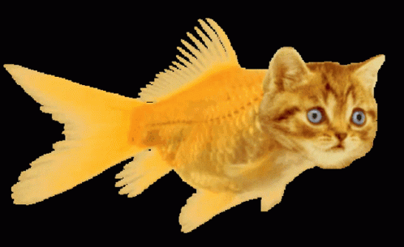

# *Hi everybody*   

* Welcome to my github profile

  

>### " Keep coding ! " 

# *About me*  

### My name is Iacomachi Cristian and I'm a CS 💻 student from Chișinău , Moldova  , currently living and studying in Petroșani , Romania  . 

### In my free time I love creating mini projects , especially websites which you can all find them here on my github profile 😊.

# Skills and Knowledge  
>* HTML 
>   * Sublime Text 3
>* CSS
>    * Bootstrap
>* JavaScript
>   * NodeJS
>* Java
>    * Netbeans
>* MarkDown
>* Web scraping
>* Batch scripts
>* VBScript

   

<b>&copy; Crys28 </b>

